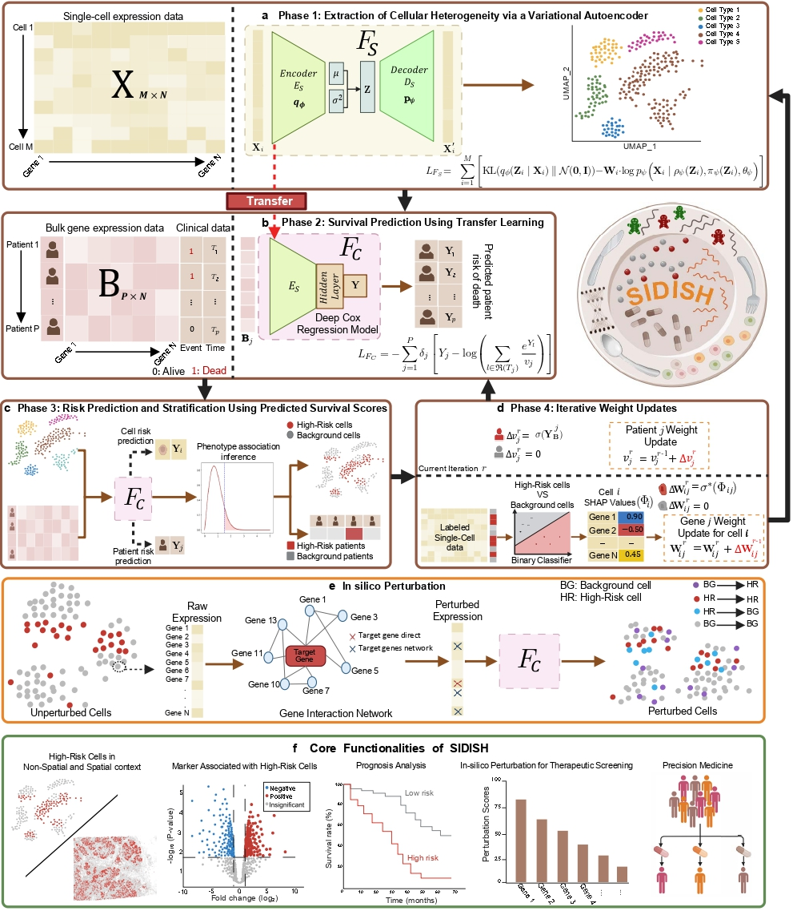

# **SIDISH**  
**SIDISH Identifies High-Risk Disease-Associated Cells and Biomarkers by Integrating Single-Cell Depth and Bulk Breadth**

## Table of Contents
- [Key Capabilities](#key-capabilities)
- [Methods Overview](#methods-overview)
- [Prerequisites](#prerequisites)
- [Installation](#installation)
- [Contact](#contact)

## Key Capabilities
- **Multi-Scale Data Integration** – Combines **single-cell** and **bulk** RNA-seq data to enhance disease and biomarker insights.  
- **High-Risk Cell Identification** – Detects disease-associated cell populations linked to poor survival outcomes.  
- **Biomarker Discovery** – Utilizes iterative deep learning and SHAP-based feature selection to identify clinically significant genes.  
- **In-Silico Perturbation (Flexible Modes)** – Simulates gene knockouts using both **binary scoring** (percentage of High-Risk cells switching to Background) and **optional continuous scoring** (average shift in predicted risk scores), capturing both strong and subtle effects.
- **Precision Medicine Applications** – Enables patient stratification and therapeutic prioritization for diseases such as Pancreatic Ductal Adenocarcinoma (PDAC), and triple-negative Breast Cancer (TNBC). 
- **Adaptive Risk Distribution Modeling** – Supports a default Weibull distribution for survival risk modeling, with an **optional data-driven selection** procedure that compares Weibull, Gamma, and Exponential families to automatically choose the best-fitting distribution based on AIC, BIC, KS statistic, and R². 
- **Spatial Transcriptomics Compatible** – Incorporates spatial transcriptomics and graph-based learning to identify High-Risk cell subpopulations in their tissue context.
- **Scalable & Generalizable** – Adapts to large datasets and diverse disease types, ensuring robust and clinically meaningful analyses.  


## Methods Overview

Understanding disease mechanisms at both cellular and clinical levels remains a major challenge in biomedical research. Single-cell RNA sequencing (scRNA-seq) provides high-resolution insights into cellular heterogeneity but is costly and lacks a large-scale clinical context. Conversely, bulk RNA sequencing (bulk RNA-seq) enables large-cohort studies but obscures critical cellular-level variations by averaging gene expression across thousands of cells.  

**SIDISH (Semi-supervised Iterative Deep Learning for Identifying Single-cell High-Risk Populations)** overcomes these limitations by integrating **scRNA-seq, bulk RNA-seq, and spatial transcriptomics** through an advanced deep learning framework. By iteratively refining High-Risk cell predictions using **Variational Autoencoders (VAE)**, **Deep Cox Regression**, and **SHAP-based feature selection**, SIDISH uncovers cellular subpopulations linked to poor survival while enabling robust patient-level risk assessment. In addition to identifying High-Risk cells, SIDISH extends to **spatial data**, allowing the discovery and localization of malignant subpopulations within their tissue context. SIDISH also employs **in silico perturbation** to simulate gene knockouts, ranking potential therapeutic targets based on their impact on disease progression. This combined ability—**disease risk assessment, spatial mapping, and therapeutic prioritization**—positions SIDISH as a transformative tool in **precision medicine, biomarker discovery, and drug development**.

Explore comprehensive details, including API references, usage examples, and tutorials (in [Jupyter notebook](https://jupyter.org/) format), in our [full documentation](https://sidish.readthedocs.io/en/latest/api.html) and the README below.


## Prerequisites
First, create a new conda environment and activate it:
```bash
conda create --name sidish_env python=3.12
```
Activate the environment:
```bash
conda activate sidish_env
```
Then, install the version of PyTorch compatible with your devices by following the [instructions on the official website](https://pytorch.org/get-started/locally/). 

## Installation

### Step 1: Install SIDISH 
There are 3 ways to install SIDISH:

**(Please install directly from GitHub to use the provided Jupyter notebooks for tutorials)**

```
git clone https://github.com/mcgilldinglab/SIDISH.git
cd SIDISH
```

Installing the SIDISH Package
1. Standard Installation
```
pip install .
```

2. Developer Mode Installation
```
pip install -e .
```

3. PyPI Installation
   
```
pip install SIDISH==1.0.0
```

### Step 2: Install Dependencies
After installing SIDISH, ensure all required dependencies are installed in your environment. Run the following command in your terminal:
```
pip install -r requirements.txt
```


## Tutorials:
To download the Lung Adenocarcinoma single-cell data as well as the bulk and paired survival data used in the tutorial, follow this [link](https://drive.google.com/file/d/1myrifg9f4fvFgunwpDzkPhlZ9AZUxLuX/view?usp=sharing).

### Preprocessing single-cell and bulk data  
[Tutorial 0: Preprocess LUAD single-cell data and paired bulk RNA-seq and survival data for SIDISH training](https://github.com/mcgilldinglab/SIDISH/blob/main/tutorials/tutorial_0_data_preprocessing.ipynb)  

### Running SIDISH on lung cancer dataset and saving results  
[Tutorial 1: Train SIDISH using the LUAD dataset and save trained model outputs](https://github.com/mcgilldinglab/SIDISH/blob/main/tutorials/tutorial_1_initializing_and_training_SIDISH.ipynb)  

### Reloading SIDISH and visualization of results  
[Tutorial 2: Reload a trained SIDISH model and visualize High-Risk cell subpopulations](https://github.com/mcgilldinglab/SIDISH/blob/main/tutorials/tutorial_2_reload_SIDISH_and_visualization.ipynb)  

### Running SIDISH’s in silico perturbation feature on lung cancer dataset  
[Tutorial 3: Perform in silico perturbation using the LUAD dataset and visualize therapeutic effects](https://github.com/mcgilldinglab/SIDISH/blob/main/tutorials/tutorial_3_perturbation.ipynb) 


If you find the tool is useful to your study, please consider citing the SIDISH [manuscript](https://www.nature.com/articles/s41467-025-66162-4).

## Contact
[Yasmin Jolasun](mailto:yasmin.jolasun@mail.mcgill.ca) and [Jun Ding](mailto:jun.ding@mcgill.ca)
