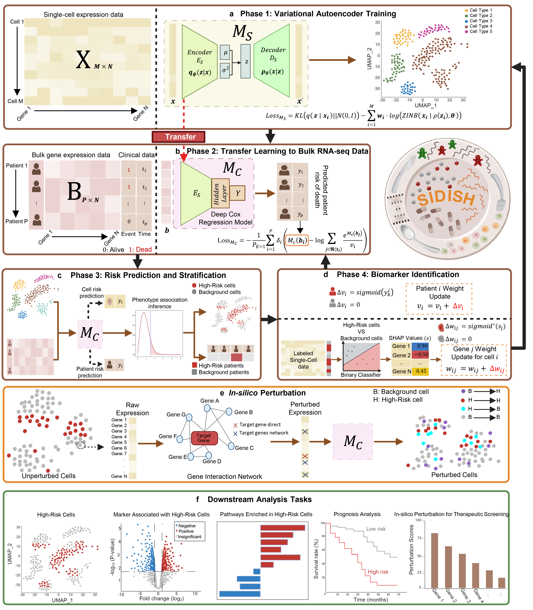

# SIDISH
SIDISH Identifies High-Risk Disease-Associated Cells and Biomarkers by Integrating Single-Cell Depth and Bulk Breadth

## Overview 


SIDISH (Semi-supervised Iterative Deep learning for Identifying Single-cell High-risk populations) is an innovative neural network framework developed to address the limitations of current RNA sequencing technologies. Single-cell RNA sequencing (scRNA-seq) excels at capturing cellular heterogeneity with unparalleled resolution, but its high cost restricts its use to small patient cohorts, limiting its clinical utility. In contrast, bulk RNA sequencing (bulk RNA-seq) is cost-effective and scalable for large cohorts but lacks the cellular-level granularity required for precise biological insights.

SIDISH bridges this gap by seamlessly integrating the depth of scRNA-seq with the breadth of bulk RNA-seq, creating a hybrid framework capable of delivering high-resolution cellular insights while retaining cohort-wide relevance. By leveraging advanced machine learning techniques, including a Variational Autoencoder (VAE) and Deep Cox Regression, SIDISH iteratively learns to predict clinical outcomes at both cellular and patient levels. This iterative learning process enables SIDISH to refine predictions, improving accuracy and relevance over time.

The framework not only identifies high-risk disease-associated cells but also uncovers actionable biomarkers critical for therapeutic development. Additionally, its in-silico perturbation capability simulates gene-level interventions, providing insights into potential therapeutic targets and their impact on reducing high-risk cellular populations. These features position SIDISH as a transformative tool in precision medicine, enabling cost-effective, scalable, and clinically relevant analyses to advance biomarker discovery and therapeutic strategies.

## Key Capabilities
- **Integrated Data Analysis**: Combines the cellular resolution of scRNA-seq with the scalability of bulk RNA-seq to bridge genetic and clinical insights.
    
- **High-Risk Population Identification**: Detects high-risk single-cell populations linked to poor survival outcomes in diseases.
    
- **Biomarker Discovery**: Uncovers actionable disease biomarkers through advanced feature selection and differential gene analysis.
    
- **In-Silico Perturbation**: Simulates gene knockouts to screen for therapeutic targets and assess their impact on disease survivability.
    
- **Scalable and Generalizable Framework**: Adapts to large datasets while maintaining precision, validated on PDAC and TNBC datasets.

## Installation

Create a new conda environment
```
conda create -n sidish python=3.9
conda activate sidish
```

### Current Installation Option: Install from Github

Installing SIDISH directly from GitHub ensures you have the latest version. **(Please install directly from GitHub to use the provided Jupyter notebook for the tutorial.)**

```
git clone https://github.com/mcgilldinglab/SIDISH.git
cd SIDISH
pip install .
```

## Tutorials:

### Running SIDISH on lung cancer dataset and visualization of results
[Train SIDISH using lung cancer dataset and visualise your results](https://github.com/mcgilldinglab/SIDISH/blob/main/TUTORIAL/tutorial.ipynb)

## Contact
[Yasmin Jolasun](mailto:yasmin.jolasun@mail.mcgill.ca) and [Jun Ding](mailto:jun.ding@mcgill.ca)
