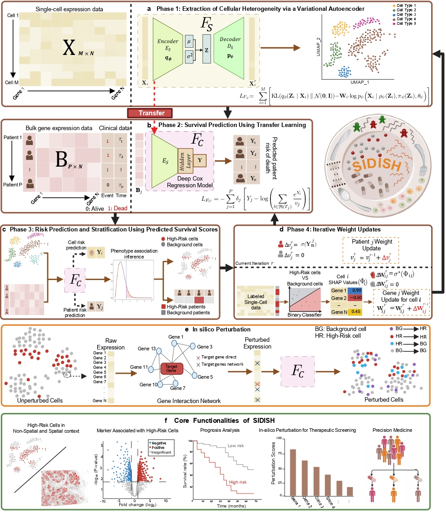

# **SIDISH**  
**SIDISH Identifies High-Risk Disease-Associated Cells and Biomarkers by Integrating Single-Cell Depth and Bulk Breadth**

> **This branch (`codex/SIDISH_agent`) adds the SIDISH Agent** — a research-use clinician
> decision-support workspace built on top of the core SIDISH package. The core library and
> tutorials are unchanged in purpose; the Agent wraps them in a case-bound chat, reproducible
> analysis jobs, evidence provenance, and a decision-support report. See
> [SIDISH Agent](#sidish-agent) below.

## Table of Contents
- [Key Capabilities](#key-capabilities)
- [Methods Overview](#methods-overview)
- [Prerequisites](#prerequisites)
- [Installation](#installation)
- [Tutorials](#tutorials)
- [SIDISH Agent](#sidish-agent)
  - [What the Agent does](#what-the-agent-does)
  - [Agent installation](#agent-installation)
  - [Configuring approved assets](#configuring-approved-assets)
  - [Running the Agent](#running-the-agent)
  - [Data routing](#data-routing)
  - [Command-line workflows](#command-line-workflows)
  - [Safety and scope](#safety-and-scope)
- [Contact](#contact)

## Key Capabilities
- **Multi-Scale Data Integration** – Combines **single-cell** and **bulk** RNA-seq data to enhance disease and biomarker insights.  
- **High-Risk Cell Identification** – Detects disease-associated cell populations linked to poor survival outcomes.  
- **Biomarker Discovery** – Utilizes iterative deep learning and SHAP-based feature selection to identify clinically significant genes.  
- **In-Silico Perturbation (Flexible Modes)** – Simulates gene knockouts using both **binary scoring** (percentage of High-Risk cells switching to Background) and **optional continuous scoring** (average shift in predicted risk scores), capturing both strong and subtle effects.
- **Precision Medicine Applications** – Enables patient stratification and therapeutic prioritization for diseases such as Pancreatic Ductal Adenocarcinoma (PDAC), and triple-negative Breast Cancer (TNBC). 
- **Adaptive Risk Distribution Modeling** – Supports a default Weibull distribution for survival risk modeling, with an **optional data-driven selection** procedure that compares Weibull, Gamma, and Exponential families to automatically choose the best-fitting distribution based on AIC, BIC, KS statistic, and R². 
- **Spatial Transcriptomics Compatible** – Incorporates spatial transcriptomics and graph-based learning to identify High-Risk cell subpopulations in their tissue context.
- **Scalable & Generalizable** – Adapts to large datasets and diverse disease types, ensuring robust and clinically meaningful analyses.  


## Methods Overview

Understanding disease mechanisms at both cellular and clinical levels remains a major challenge in biomedical research. Single-cell RNA sequencing (scRNA-seq) provides high-resolution insights into cellular heterogeneity but is costly and lacks a large-scale clinical context. Conversely, bulk RNA sequencing (bulk RNA-seq) enables large-cohort studies but obscures critical cellular-level variations by averaging gene expression across thousands of cells.  

**SIDISH (Semi-supervised Iterative Deep Learning for Identifying Single-cell High-Risk Populations)** overcomes these limitations by integrating **scRNA-seq, bulk RNA-seq, and spatial transcriptomics** through an advanced deep learning framework. By iteratively refining High-Risk cell predictions using **Variational Autoencoders (VAE)**, **Deep Cox Regression**, and **SHAP-based feature selection**, SIDISH uncovers cellular subpopulations linked to poor survival while enabling robust patient-level risk assessment. In addition to identifying High-Risk cells, SIDISH extends to **spatial data**, allowing the discovery and localization of malignant subpopulations within their tissue context. SIDISH also employs **in silico perturbation** to simulate gene knockouts, ranking potential therapeutic targets based on their impact on disease progression. This combined ability—**disease risk assessment, spatial mapping, and therapeutic prioritization**—positions SIDISH as a transformative tool in **precision medicine, biomarker discovery, and drug development**.

Explore comprehensive details, including API references, usage examples, and tutorials (in [Jupyter notebook](https://jupyter.org/) format), in our [full documentation](https://sidish.readthedocs.io/en/latest/api.html) and the README below.


## Prerequisites
First, create a new conda environment and activate it:
```bash
conda create --name sidish_env python=3.12
```
Activate the environment:
```bash
conda activate sidish_env
```
Then, install the version of PyTorch compatible with your devices by following the [instructions on the official website](https://pytorch.org/get-started/locally/). 

## Installation

### Step 1: Install SIDISH 
There are 3 ways to install SIDISH:

**(Please install directly from GitHub to use the provided Jupyter notebooks for tutorials)**

```
git clone https://github.com/mcgilldinglab/SIDISH.git
cd SIDISH
```

Installing the SIDISH Package
1. Standard Installation
```
pip install .
```

2. Developer Mode Installation (Recommended)
```
pip install -e .
```

3. PyPI Installation
   
```
pip install SIDISH==1.0.0
```

### Step 2: Install Dependencies
After installing SIDISH, ensure all required dependencies are installed in your environment. Run the following command in your terminal:
```
pip install -r requirements.txt
```


## Tutorials
To download the Lung Adenocarcinoma single-cell data as well as the bulk and paired survival data used in the tutorial, follow this [link](https://drive.google.com/file/d/1myrifg9f4fvFgunwpDzkPhlZ9AZUxLuX/view?usp=sharing).

### Preprocessing single-cell and bulk data  
[Tutorial 0: Preprocess LUAD single-cell data and paired bulk RNA-seq and survival data for SIDISH training](https://github.com/mcgilldinglab/SIDISH/blob/main/tutorials/tutorial_0_data_preprocessing.ipynb)  

### Running SIDISH on lung cancer dataset and saving results  
[Tutorial 1: Train SIDISH using the LUAD dataset and save trained model outputs](https://github.com/mcgilldinglab/SIDISH/blob/main/tutorials/tutorial_1_initializing_and_training_SIDISH.ipynb)  

### Reloading SIDISH and visualization of results  
[Tutorial 2: Reload a trained SIDISH model and visualize High-Risk cell subpopulations](https://github.com/mcgilldinglab/SIDISH/blob/main/tutorials/tutorial_2_reload_SIDISH_and_visualization.ipynb)  

### Running SIDISH’s in silico perturbation feature on lung cancer dataset  
[Tutorial 3: Perform in silico perturbation using the LUAD dataset and visualize therapeutic effects](https://github.com/mcgilldinglab/SIDISH/blob/main/tutorials/tutorial_3_perturbation.ipynb) 


If you find the tool is useful to your study, please consider citing the SIDISH [manuscript](https://www.nature.com/articles/s41467-025-66162-4).

---

# SIDISH Agent

**SIDISH Agent** is a research-use workspace around SIDISH. It combines a case-bound chat,
reproducible analysis jobs, evidence provenance, scientific and clinical review, and a
six-page decision-support report. It is designed to help an oncologist, pathologist, or
molecular tumour board decide what to investigate next.

> **Research use only.** SIDISH Agent does **not** diagnose disease, estimate an individual's
> absolute outcome, select treatment, or replace guideline-based care. All biological and
> therapeutic outputs are computational observations or hypotheses requiring orthogonal
> confirmation and qualified clinician review.

## What the Agent does
- Pseudonymous, case-isolated workspaces with audit trails.
- A **Chat with SIDISH** interface that runs only the capability requested, caches results,
  accepts named genes/pathways/drugs, and renders perturbation UMAPs and statistics inline.
- Patient-column discovery after upload and an explicit analysis-scope selector: analyse one
  patient/sample or every cell in the uploaded single-cell dataset (switchable without retraining).
- Patient/sample-specific or dataset-wide high-risk burden, cohort marker/pathway/survival
  context, and target-plus-PPI-network perturbation.
- First-class `pathway_perturbation` and `drug_perturbation` tools with explicit evidence-scope labels.
- HTML/PDF decision-support reports with QC, provenance, limitations, and two-reviewer sign-off —
  either complete or focused on a single requested target.
- Consent-gated durable training jobs, with a per-case training-iteration setting (1–100).
- Fail-closed clinician mode: mock evidence is never silently substituted.

## Agent installation
The Agent uses a dedicated environment. From the repository root:

```bash
conda env create -f environment.yml
conda activate sidish-agent
cp .env.example .env          # then edit .env (see below)
python skills/sidish-report-orchestrator/scripts/check_python_env.py
python -m unittest discover -s tests -v
```

Recommended Python is 3.11. Scientific and app dependencies are declared in `environment.yml`,
`pyproject.toml`, and `requirements-app.txt`.

## Configuring approved assets
Copy `.env.example` to `.env` and point each supported cancer to its locked manuscript
bulk-survival table and, when available, its trained reference run:

```bash
SIDISH_BREAST_BULK=/approved/BREAST_CANCER/bulk_result.csv
SIDISH_BREAST_RUN=/approved/BREAST_CANCER
SIDISH_LUNG_BULK=/approved/LUNG_CANCER/bulk_result.csv
SIDISH_LUNG_RUN=/approved/LUNG_CANCER
SIDISH_PANCREATIC_BULK=/approved/PANCREAS_CANCER/bulk_result.csv
SIDISH_PANCREATIC_RUN=/approved/PANCREAS_CANCER
SIDISH_PPI_DIR=/approved/PPI            # HIPPIE + STRING files for perturbation
SIDISH_TRAINING_DEVICE=cuda:1
```

Large reference data, PPI files, trained models, and run outputs are **not** tracked in git
(see `.gitignore`); configure their locations through `.env`. Set `SIDISH_LLM_PROVIDER=auto`
to use Gemini/OpenAI when a key is present, a configured compatible endpoint, or local Ollama
as the no-key fallback. If no provider is available, a validated local entity parser is used.

## Running the Agent
```bash
export SIDISH_APP_PASSWORD='use-a-secret-from-your-secret-manager'
streamlit run app.py --server.address 127.0.0.1
```

Create a pseudonymous case, upload a preprocessed `.h5ad`, and choose the cancer reference.
After validation, choose the `AnnData.obs` patient/sample column and one identifier. Open
**Chat with SIDISH** and ask the first analysis question; if training is required, SIDISH
explains why and asks for confirmation before submitting a durable training task. Read-only
questions (e.g. raw cell counts) never trigger training. Once trained, each question runs only
its required calculation, reusing cached models and results. Ask **generate the final report**
to complete only the missing evidence and expose the HTML/PDF downloads below the conversation.

On a Mac without CUDA, training falls back to CPU and is much slower; run training where
`SIDISH_TRAINING_DEVICE` points to an available CUDA device. See
[`LIVE_SETUP.md`](LIVE_SETUP.md) for full live-data configuration and
[`docs/ARCHITECTURE.md`](docs/ARCHITECTURE.md) for the evidence and safety boundaries.

## Data routing
The upload policy is enforced in the UI, preflight, and training workflow:

1. Breast, lung, or pancreatic single-cell data uses the corresponding locked SIDISH manuscript
   bulk RNA-seq plus survival reference; a user-uploaded bulk cohort is not substituted.
2. Any other disease requires a matched bulk-survival CSV with the exact layout
   `duration,event,<gene1>,<gene2>,...`, validated row-by-row before training.
3. A newly uploaded single-cell dataset is trained against the routed bulk cohort before
   patient-level analysis; a model trained on a different dataset is never silently reused.
4. Training requires unique single-cell gene names, at least 500 shared genes, and at least 80%
   coverage of the routed bulk gene set.

## Command-line workflows
```bash
python sidish_cli.py preflight -c configs/sidish_workflow_template.yaml
python sidish_cli.py run       -c configs/sidish_workflow_template.yaml
python sidish_cli.py report --patient CID3946 --pdf
```

Long training jobs should use the durable runner:

```bash
python skills/sidish-report-orchestrator/scripts/sidish_job.py submit \
  --config configs/sidish_training_template.yaml --job-name new-case-training
```

## Safety and scope
- Use pseudonymous IDs; do not place direct identifiers in chat.
- Keep clinician mode fail-closed (`SIDISH_DEMO_MODE=0`).
- Restrict app binding, configure authentication, and use encrypted institutional storage
  before handling real health information.
- Require both scientific and clinical sign-off before releasing a report, and complete the
  release gates in [`docs/CLINICAL_RELEASE_GATES.md`](docs/CLINICAL_RELEASE_GATES.md).
- Do not use the software for autonomous diagnosis or treatment selection.

## Contact
[Yasmin Jolasun](mailto:yasmin.jolasun@mail.mcgill.ca) and [Jun Ding](mailto:jun.ding@mcgill.ca)
